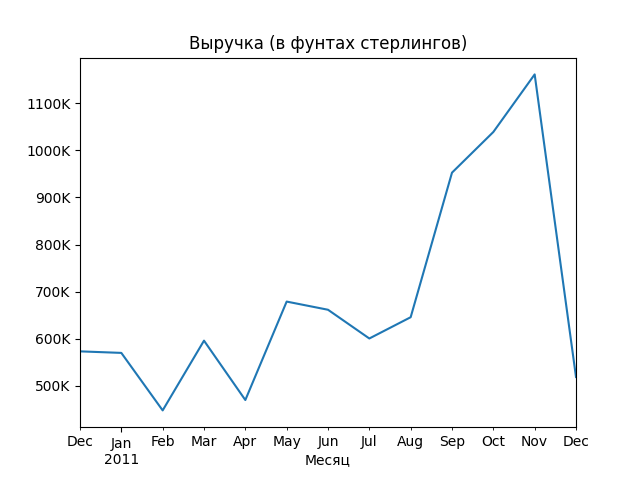
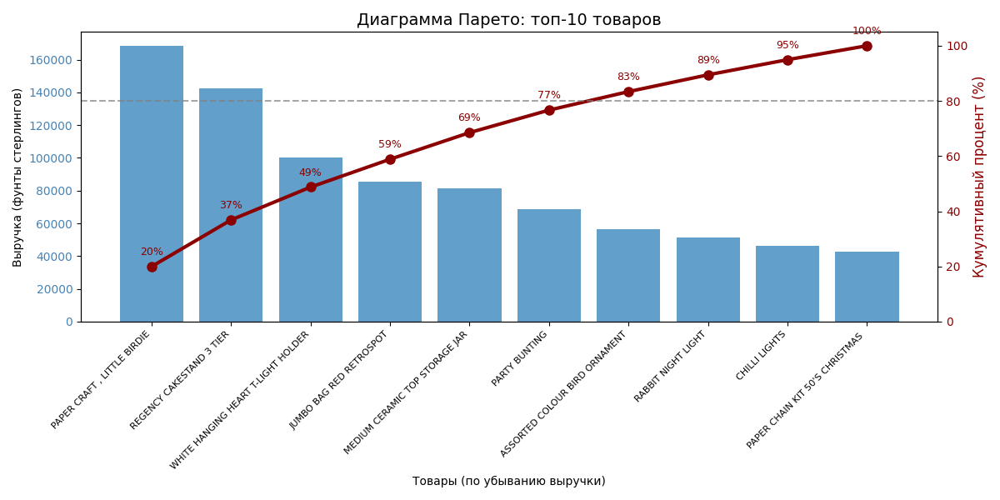

# Анализ данных интернет-магазина для выявления закономерностей продаж и поведения клиентов

## Использованные технологии

- Python
- pandas
- matplotlib
- numpy

## Что сделано

- Очистка данных
- Анализ продаж
- Визуализация данных
- Расчёт ключевых метрик

## Визуализация





## Основные выводы

- Продажи имеют сезонный характер с пиком осенью
- Основная выручка приходится на небольшое число клиентов
- Отдельные товары формируют значительную долю дохода

## Как запустить проект

```bash
pip install -r requirements.txt
jupyter notebook
